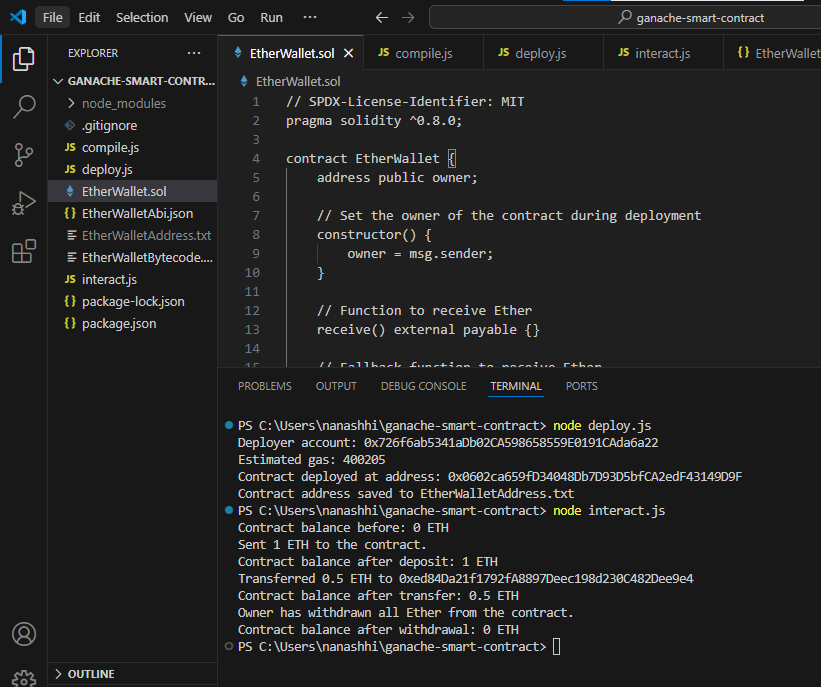
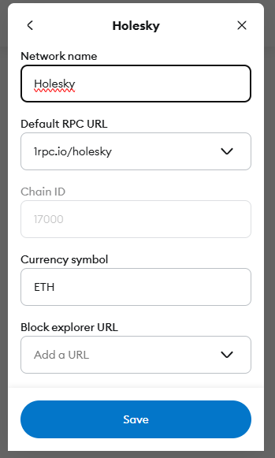
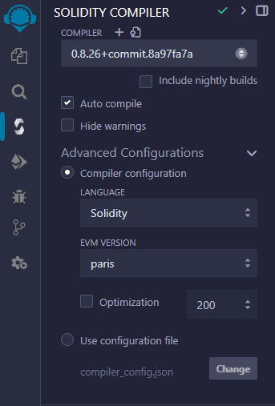
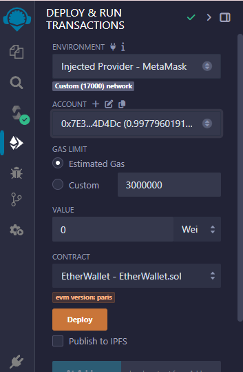

# Blockchain Assignment 1 - Ether Wallet

## Team: Tapen Tomiris , Ayaulym Kenzhekul

This project demonstrates a basic **Ether wallet** smart contract that:
- Accepts Ether deposits.
- Allows the owner to withdraw the entire balance.
- Displays the contract's balance.

 ## Features
- Built with **Solidity**.
- Deployed using **Web3.js** and **Ganache**.
- Interaction scripts for deploying and interacting with the contract.
- Höleski:Deploying smart contract via remix IDE, Public Ethereum testnet.

## Prerequisites
To get this project up and running, you will need to have the following installed:
- **Node.js v18.20.5** (installed via NVM)
- **Web3.js v1.10.0** (installed via npm)
- **Solidity Compiler (solc) v0.8.0**
- **Ganache v2.9.0** (running on HTTP://127.0.0.1:7545)

And if needed to deploy by remix **testnets** then install:
-  **MetaMask** chrome extention;
-  Ganache
-  Remix IDE (for testnet deployment))

## Usage
**Setup Instructions**

**1. Clone the Repository**
Clone the repository to your local machine:
```
git clone https://github.com/tomiristapen/BlockchainAssignment1.git
cd BlockchainAssignment1
```
**2. Install Dependencies**
Install the required dependencies using npm:
```
npm install
```
This will install Web3.js,node_modules\ and other necessary libraries.
## Deployment Options
**Option 1: Deploy Using Web3.js and Ganache**

**Step 1: Set up Ganache**
- Open Ganache and start a new workspace.
- Ganache should be running on http://127.0.0.1:7545.

**Step 2: Configure Web3.js**
-Ensure you have Web3.js set up to connect to Ganache in your project. Modify the connection settings in the code (in interact.js) if necessary:

```javascript
const web3 = new Web3('http://127.0.0.1:7545'); // Ensure Ganache is running at this address
```
**Step 3: Deploy the Smart Contract**
Run the deploy script to deploy your EtherWallet contract to Ganache:
bash
```
node deploy.js
```
**The contract will be deployed, and you will see the contract address in the console output.**

**Step 4: Create EtherWalletAddress.txt with Contract Address**
- Once the contract is deployed successfully, you'll see the contract address in the console output. This address is critical for interacting with the deployed contract.

- Locate the contract address: After running the deploy.js script, the output in your terminal will look something like this:
```
Deployer account: 0x726f6ab5341aDb02CA598658559E0191CAda6a22
Estimated gas: 400205
Contract deployed at address: 0x1234567890abcdef1234567890abcdef12345678
Contract address saved to EtherWalletAddress.txt
```
- Copy the **contract address** (the long string starting with 0x).
- Create EtherWalletAddress.txt:
In your project directory, create a new text file named **EtherWalletAddress.txt**.
- Open the file and paste the contract address you copied earlier into the file.
It should look like this:
```
0x1234567890abcdef1234567890abcdef12345678
```
Save the file.
**Step 5: Interact with the Contract**
- You can use the provided interact.js script to interact with the contract (deposit Ether, check balance, transfer funds):
```
node interact.js
```
**This script allows you to:**
- Deposit Ether into the contract.
- Check the balance of the contract.
- Transfer Ether to another account.
- Withdraw Ether (if you are the owner).


## Option 2: Deploying smart contract via remix & public testnet

**Set up Metamask:**
Install the Metamask browser extension from here.
Create or import your wallet into Metamask.
Make sure you have some ETH in your Metamask wallet (you can use the free faucet for testnets).


**Go to Remix IDE**
- Copy the Smart Contract Code:
- Create a new Solidity file in Remix (e.g., EtherWallet.sol).
- Copy the EtherWallet.sol contract code from this repository into that file.
- Compile the Contract:

**On the Solidity Compiler tab:**
- Select the Advanced Configuration option.
- Set the EVM Version to Paris (this is required to ensure compatibility with Ganache

- Click Compile.
  

**Deploy the Contract:**

On the Deploy & Run Transactions tab:
- Select Injected Web3 (Metamask should be connected).
- Ensure Metamask is connected to Ganache (or Hölski Testnet if using a public testnet).
- Choose the compiled contract (EtherWallet) from the dropdown.
  


After the contract is deployed, Remix will show the contract address in the Deployed Contracts section.
